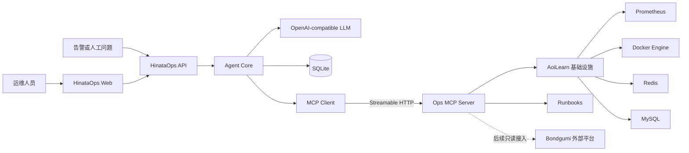
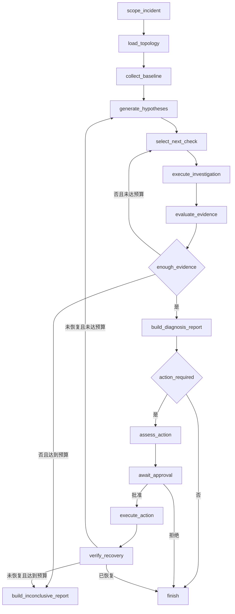
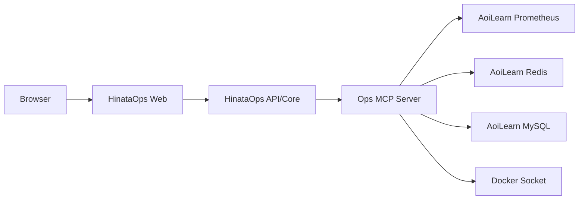

# HinataOps 架构设计

## 1. 文档状态

- 状态：初版已确认
- 适用范围：HinataOps 第一阶段
- 关联文档：[项目范围与故障诊断设计](PROJECT_SCOPE_AND_INCIDENT_DESIGN.md)

本文档描述 HinataOps 的技术选型、组件边界、运行时流程、状态模型、MCP 集成、持久化、权限、可观测性和测试策略。具体故障家族、故障注入与验收目标以项目范围文档为准。

## 2. 架构目标

HinataOps 第一阶段需要满足：

1. 接入 AoiLearn 的真实 Prometheus、Docker、Redis 和 MySQL 数据。
2. 根据服务拓扑调查问题，而不是把所有 Tool 无差别交给模型。
3. 保存结构化证据、候选根因、支持证据和反证。
4. 支持有界循环调查，避免无限调用 Tool。
5. 支持人工审批、暂停、恢复、执行和恢复验证。
6. 同一调查框架后续能够接入 Bondgumi 的 CloudWatch、Sentry 和 Cloudflare。
7. 核心能力可以通过故障注入和离线评测重复验证。

项目不以建设通用企业运维平台为目标。复杂度集中在调查编排、证据管理和受控处置，外围基础设施保持简单。

## 3. 技术选型

| 层次 | 技术 | 用途 |
| --- | --- | --- |
| Agent 后端 | Python 3.13 | 调查编排、模型调用、证据处理 |
| 工作流 | LangGraph | 显式状态图、循环调查、checkpoint、人工中断 |
| 数据模型 | Pydantic 2 | 状态、证据、假设、动作和 Tool 返回值校验 |
| API | FastAPI | 事故创建、查询、事件流和审批接口 |
| 前端 | React、TypeScript、Vite | 事故时间线、证据、假设和审批界面 |
| MCP | 官方 MCP Python SDK | Ops MCP Server 与 MCP Client |
| MCP 传输 | Streamable HTTP | Core 与独立 MCP Server 的运行时通信 |
| HTTP 客户端 | HTTPX | Prometheus、健康检查和外部平台 API |
| Redis 客户端 | redis-py asyncio | Stream、Consumer Group 和结果查询 |
| MySQL 客户端 | SQLAlchemy Core + asyncmy | 参数化只读领域查询 |
| Docker 客户端 | Docker Engine SDK for Python | 容器状态、日志、资源和受控动作 |
| 状态存储 | SQLite | LangGraph checkpoint 与 Demo 业务数据 |
| 自身可观测性 | JSON 日志、OpenTelemetry | 节点、模型和 Tool 调用链路 |
| 测试 | pytest、Docker Compose | 单元测试、集成测试、故障注入和评测 |
| 包管理 | uv | Python 依赖管理与锁定 |

LLM 通过 OpenAI-compatible 接口接入，避免核心代码绑定单一模型供应商。项目环境固定由 `uv` 创建和运行，不使用 PATH 中的 Anaconda Python。

Runbook RAG 在第一条调查链路完成后实现，初期使用 Markdown 文档，后续按需要引入 Qdrant、向量检索和关键词混合召回。

## 4. 系统上下文



### 4.1 信任边界

HinataOps Core 不直接保存基础设施凭证，也不直接访问 Docker Socket、Redis 或数据库。所有基础设施访问均通过 Ops MCP Server。

```text
Agent Core：决定查什么、如何解释、是否建议动作
Ops MCP Server：决定请求是否合法、如何访问基础设施、返回什么事实
```

生产环境与 Demo 环境使用不同的 MCP 配置和工具权限：

- `aoi-learn-demo`：只读工具 + 少量需审批的写工具。
- `bondgumi-production`：只读工具，不注册写工具。

## 5. 组件设计

### 5.1 HinataOps API

职责：

- 创建事故调查。
- 查询事故状态和历史。
- 以 SSE 输出调查进度事件。
- 接收批准、拒绝和人工反馈。
- 恢复暂停的 LangGraph 运行。

API 不包含基础设施查询逻辑，也不直接实现根因推理。

第一阶段计划提供：

```text
POST /api/incidents
GET  /api/incidents/{incident_id}
GET  /api/incidents/{incident_id}/events
POST /api/incidents/{incident_id}/approval
```

### 5.2 Agent Core

职责：

- 解析告警或人工问题。
- 确定目标环境、影响服务和时间窗口。
- 加载服务拓扑。
- 规划并行的基础证据采集。
- 生成和更新候选根因假设。
- 选择具有区分度的下一步检查。
- 判断是否已有足够证据。
- 生成诊断报告和动作建议。
- 进入人工审批节点。
- 执行动作后验证恢复。

Agent Core 内部采用一个调查图，而不是多个自由对话 Agent。不同数据源由 Tool 和确定性节点区分，不抽象成“日志专家”“数据库专家”等角色。

### 5.3 Ops MCP Server

职责：

- 注册并暴露 Tool。
- 管理数据源客户端生命周期。
- 从环境配置或 Secret 获取凭证。
- 对 Tool 参数进行类型和范围校验。
- 执行日志截断、时间范围限制和结果标准化。
- 为写工具检查目标环境和允许列表。
- 返回结构化数据，不返回面向用户的诊断结论。

第一阶段使用一个 MCP Server，并按照名称前缀区分领域：

```text
topology_*
prometheus_*
docker_*
redis_*
mysql_*
runbook_*
deployment_*
```

未来只有在部署、权限或故障隔离确实需要时，才拆分为多个 MCP Server。

### 5.4 Web

Web 不是第一条纵向链路的前置条件，但最终 Demo 需要提供以下视图：

- 事故概览和影响范围。
- 调查时间线。
- Tool 调用及其状态。
- 结构化证据详情。
- 候选假设及置信度变化。
- 支持证据和反证。
- 待审批动作及风险说明。
- 执行结果和恢复验证。

前端只展示后端事件和提交审批决策，不在浏览器中执行诊断逻辑。

## 6. 代码组织

计划采用单仓库、两个 Python 运行进程和一个前端项目：

```text
HinataOps/
├── apps/
│   ├── api/
│   │   └── main.py
│   └── ops_mcp/
│       └── server.py
├── src/
│   └── hinata_ops/
│       ├── agent/
│       │   ├── graph.py
│       │   ├── state.py
│       │   ├── routing.py
│       │   └── nodes/
│       ├── domain/
│       │   ├── incident.py
│       │   ├── evidence.py
│       │   ├── hypothesis.py
│       │   └── action.py
│       ├── mcp/
│       │   └── client.py
│       ├── services/
│       │   ├── investigation.py
│       │   ├── approval.py
│       │   └── verification.py
│       ├── persistence/
│       └── observability/
├── ops_mcp/
│   ├── tools/
│   │   ├── prometheus.py
│   │   ├── docker.py
│   │   ├── redis.py
│   │   ├── mysql.py
│   │   └── runbook.py
│   └── adapters/
├── web/
├── topologies/
│   ├── aoi-learn.yml
│   └── bondgumi.yml
├── runbooks/
├── evals/
│   ├── cases/
│   └── scorers/
├── tests/
├── docs/
└── pyproject.toml
```

该结构是目标结构，不要求在第一次提交中一次性创建所有目录。目录只在出现对应实现时创建。

### 6.1 依赖方向

```text
API ───────→ Agent/Application ───────→ Domain
                    │
                    ├──→ MCP Client Interface
                    ├──→ Persistence Interface
                    └──→ LLM Interface

Ops MCP Tools ─────→ Infrastructure Adapters
```

Domain 模型不依赖 FastAPI、LangGraph、具体 LLM SDK 或具体数据库客户端。

## 7. 调查状态模型

### 7.1 IncidentState

```python
class IncidentState:
    incident_id: str
    query: str
    target_environment: str
    time_window: TimeWindow
    affected_services: list[str]
    topology: dict
    observations: list[Observation]
    hypotheses: list[Hypothesis]
    investigation_round: int
    proposed_action: ProposedAction | None
    approval_status: str | None
    execution_result: ExecutionResult | None
    verification_result: VerificationResult | None
```

State 中保存原始结构化数据或稳定引用，不保存为了 Prompt 临时拼接的大段字符串。

### 7.2 Observation

```python
class Observation:
    evidence_id: str
    source: str
    tool_name: str
    query: dict
    observed_at: datetime
    value: dict
    summary: str
    reliability: str
```

要求：

- 每条证据拥有稳定 ID。
- 保存实际调用参数和采集时间。
- `value` 是 Tool 返回的事实。
- `summary` 是压缩描述，不能替代原始值。
- 后续报告必须通过 Evidence ID 引用证据。

### 7.3 Hypothesis

```python
class Hypothesis:
    hypothesis_id: str
    cause: str
    confidence: float
    supporting_evidence_ids: list[str]
    contradicting_evidence_ids: list[str]
    missing_evidence: list[str]
    next_check: ToolCheck | None
```

置信度用于排序和展示，不声明为严格的统计概率。模型必须说明置信度变化对应的证据。

### 7.4 ProposedAction

```python
class ProposedAction:
    action_id: str
    tool_name: str
    arguments: dict
    target_environment: str
    reason: str
    expected_effect: str
    risk: str
    rollback: str
    verification_plan: list[VerificationCheck]
```

动作的验证计划在审批前生成，不能等执行完后再临时决定如何判断恢复。

## 8. LangGraph 工作流



### 8.1 节点职责

| 节点 | LLM | Tool | 主要职责 |
| --- | --- | --- | --- |
| `scope_incident` | 是 | 否 | 提取环境、时间窗口、症状和初始影响范围 |
| `load_topology` | 否 | 是 | 读取目标环境拓扑 |
| `collect_baseline` | 部分 | 是 | 根据拓扑并行采集基础证据 |
| `generate_hypotheses` | 是 | 否 | 生成不超过三个候选根因 |
| `select_next_check` | 是 | 否 | 选择最能区分当前假设的检查 |
| `execute_investigation` | 否 | 是 | 调用只读 Tool 并标准化证据 |
| `evaluate_evidence` | 是 | 否 | 更新支持证据、反证和置信度 |
| `build_diagnosis_report` | 是 | 否 | 生成引用 Evidence ID 的报告 |
| `assess_action` | 部分 | 否 | 形成结构化动作与验证计划 |
| `await_approval` | 否 | 否 | 使用 interrupt 暂停并等待决定 |
| `execute_action` | 否 | 是 | 执行已批准且参数一致的动作 |
| `verify_recovery` | 部分 | 是 | 重新采集预定义信号并判断恢复 |

确定性逻辑负责循环次数、权限、参数一致性、证据 ID、状态持久化和审批结果；LLM 不直接控制这些约束。

### 8.2 调查预算

- 最多三轮补充调查。
- 每轮最多并行执行四个只读 Tool。
- 同一参数的 Tool 调用在证据有效期内不重复执行。
- 每个补充查询必须区分当前假设或补齐最高置信度假设的关键证据。
- 达到预算仍不能确认时，输出“不确定”报告和人工检查建议，不虚构根因。

## 9. MCP 设计

### 9.1 运行方式

- 单元测试：MCP Client 直接连接 Server 对象。
- 本地快速调试：可使用 stdio。
- 完整 Demo：独立 Ops MCP Server，通过 Streamable HTTP 连接。

Core 不挂载 Docker Socket，也不持有 MySQL、Redis 和外部平台凭证。

### 9.2 Tool 设计原则

每个 Tool 应满足：

1. 名称表达观测对象和动作。
2. 输入使用明确类型、枚举和有限时间范围。
3. 输出为结构化模型，不把结果预先写成诊断结论。
4. 返回采集时间、目标环境和必要的完整性信息。
5. 日志与时间序列在 MCP Server 侧聚合和截断。
6. 错误区分“目标系统异常”和“Tool 自身异常”。

例如：

```python
class RedisStreamInfoResult:
    environment: str
    stream: str
    length: int
    groups: list[ConsumerGroupInfo]
    observed_at: datetime
```

不推荐返回：

```text
Redis 好像有积压，建议重启 Judge。
```

### 9.3 数据库工具

第一阶段不向模型开放任意 SQL，而是提供参数化领域查询：

```text
mysql_get_judge_pipeline_summary
mysql_get_task_state
mysql_get_outbox_summary
```

查询实现可以使用 SQLAlchemy Core 或参数化 SQL，但返回 Schema 对 Agent 保持稳定。

### 9.4 写工具

第一阶段唯一实际写工具：

```text
docker_restart_service
```

限制：

- 只在 `aoi-learn-demo` 注册。
- 服务名必须在允许列表中。
- 调用参数必须与已批准的 ProposedAction 一致。
- 返回重启前后容器 ID、状态、时间和命令结果。
- Tool 成功不直接关闭事故，必须进入恢复验证节点。

## 10. LLM 设计

### 10.1 模型职责

LLM 只承担：

1. 理解告警或人工问题。
2. 生成、比较和更新根因假设。
3. 选择有信息增益的下一步检查。
4. 根据结构化证据生成报告。

以下逻辑由程序完成：

- 时间窗口计算。
- Prometheus 数值计算。
- Tool 参数基础校验。
- Evidence ID 完整性校验。
- 调查预算。
- 权限和审批检查。
- checkpoint 与业务持久化。
- Tool 是否执行成功。

### 10.2 结构化输出

模型输出通过 Pydantic 校验，例如：

```python
class InvestigationDecision:
    hypothesis_updates: list[HypothesisUpdate]
    next_checks: list[ToolCheck]
    enough_evidence: bool
    explanation: str
```

结构化输出失败时最多进行一次格式修复；再次失败则记录模型错误并进入可解释的失败或降级路径。

### 10.3 Prompt 上下文

单次 Prompt 只组装当前节点需要的上下文：

- 当前事故目标与时间窗口。
- 相关服务拓扑子图。
- 当前假设。
- 经过裁剪的相关证据。
- 当前节点允许执行的 Tool 描述。
- 调查预算和输出 Schema。

不将完整聊天历史、所有日志、全部拓扑和全部 Tool 返回无差别放入上下文。

## 11. 持久化设计

### 11.1 LangGraph checkpoint

使用 SQLite checkpointer 保存图运行状态，支持：

- 人工审批暂停与恢复。
- 节点失败后的恢复。
- 调查过程回放。
- 通过 `incident_id` 映射稳定的 `thread_id`。

### 11.2 业务数据

业务表保存：

```text
incidents
observations
hypotheses
proposed_actions
approvals
executions
evaluations
```

Checkpoint 是运行时快照，业务表是可检索、可展示和可评测的数据。二者职责不同，即使第一阶段使用同一个 SQLite 文件，也保持独立的数据访问代码。

## 12. API 与事件流

前端通过普通 REST 创建事故、查询最终状态和提交审批，通过 SSE 接收增量事件。

事件类型示例：

```text
incident.created
scope.completed
tool.started
tool.completed
evidence.added
hypothesis.updated
report.generated
approval.requested
approval.resolved
action.started
action.completed
verification.completed
incident.finished
```

SSE 只承载进度事件。事故真实状态保存在后端，前端断线重连后通过事故查询接口恢复，不依赖浏览器保存完整事件历史。

## 13. Runbook RAG

Runbook 的证据优先级低于实时系统状态：

```text
实时指标和状态
  > 结构化日志
  > 系统拓扑
  > 部署变化
  > Runbook
  > 模型常识
```

Runbook 用于解释指标、补充已知处置步骤、动作风险和恢复检查项，不用于覆盖实时证据。

第一阶段先读取本地 Markdown 并保留标题、服务、环境、症状和更新时间等元数据。完成核心调查链路后，再评估 Qdrant 混合检索和重排是否带来可测量收益。

## 14. HinataOps 自身可观测性

一次事故调查对应一条 OpenTelemetry Trace：

```text
incident
├── scope_incident
├── load_topology
├── collect_baseline
│   ├── prometheus_query
│   ├── redis_stream_info
│   └── mysql_get_outbox_summary
├── generate_hypotheses
├── execute_investigation
├── build_report
├── await_approval
├── execute_action
└── verify_recovery
```

Span 至少记录：

- `incident_id`
- 节点和 Tool 名称
- 目标环境和数据源
- 耗时与状态
- 返回记录数量
- 模型名称、调用次数和 Token 用量
- 异常类型，不记录凭证和未经裁剪的敏感日志

第一阶段使用 JSON 结构化日志和 OpenTelemetry SDK，默认控制台或 OTLP 导出。可视化后端只选择一个，不同时引入多个 Agent 观测平台。

## 15. 部署拓扑

### 15.1 AoiLearn Demo



推荐将 Ops MCP Server 部署在 AoiLearn Docker 主机上；只有 MCP Server 挂载 Docker Socket。HinataOps Core 可以在同一 Compose 网络或开发机运行。

### 15.2 Bondgumi 生产

第一阶段不在生产主机部署拥有写权限的 Agent。生产数据通过只读接口获取：

```text
CloudWatch API
Sentry API
Cloudflare API
公开健康检查
只读部署元数据
```

Bondgumi 环境配置不注册 `action_*` Tool。

## 16. 测试与评测

### 16.1 单元测试

- Pydantic 模型校验。
- 图路由和调查预算。
- 假设更新与 Evidence ID 校验。
- Tool 参数和结果转换。
- 权限和审批状态机。
- 日志与指标裁剪。

### 16.2 MCP 契约测试

- Tool 可被发现。
- 输入 Schema 符合预期。
- 结果能够通过 Pydantic 校验。
- 数据源异常返回明确的结构化错误。
- 写 Tool 在错误环境中不可发现或被拒绝。

### 16.3 集成测试

- 使用真实 Redis、MySQL、Prometheus 和 Docker 环境。
- 验证 AoiLearn 判题链路的真实查询。
- 验证 MCP Server 与 Core 的 Streamable HTTP 通信。
- 验证 checkpoint 暂停和恢复。

### 16.4 诊断评测

同一入口症状对应多个隐藏故障原因，评测：

- Top-1 根因准确率。
- 关键证据覆盖率。
- 反证处理。
- 无意义 Tool 调用数量。
- 未授权写操作数量。
- 恢复验证完整性。

评测器优先使用确定性 Ground Truth 和规则评分；LLM-as-a-Judge 只评价报告清晰度等难以规则化的维度，不负责判断真实根因。

## 17. 明确不采用的设计

第一阶段不采用：

- CrewAI、AutoGen 式多 Agent 角色编排。
- Temporal 等第二套持久化工作流引擎。
- Neo4j 或其他图数据库保存小规模服务拓扑。
- 任意 Shell 执行 Tool。
- 每个数据源一个微服务或 MCP Server。
- Kubernetes、Kafka 或与目标系统不一致的基础设施。
- 同时接入多个 Agent 可观测性 SaaS。
- 为少量 Runbook 提前建设复杂知识库平台。

## 18. 分阶段演进

### 阶段 1：只读纵向切片

- AoiLearn 拓扑。
- IncidentState、Observation、Hypothesis。
- 一个可运行的 Ops MCP Server。
- MySQL、Redis、Docker、Prometheus 只读 Tool。
- 判题 pending 问题的调查闭环。
- 命令行或测试入口。

### 阶段 2：监督执行

- SQLite checkpoint。
- 人工审批。
- `docker_restart_service`。
- 执行后恢复验证。

### 阶段 3：可视化与评测

- FastAPI REST/SSE。
- React 调查时间线和审批页面。
- 五类判题故障注入。
- 自动评测报告。
- OpenTelemetry Trace 展示。

### 阶段 4：第二故障家族与真实生产验证

- Web 错误率和延迟调查。
- Runbook RAG。
- Bondgumi CloudWatch、Sentry、Cloudflare 只读接入。
- 真实线上只读诊断报告。

## 19. 架构决策摘要

| 决策 | 选择 | 原因 |
| --- | --- | --- |
| 核心语言 | Python | Agent、MCP、数据分析和评测生态适合 |
| 工作流 | 显式 LangGraph | 调查循环、暂停恢复和状态可检查 |
| Agent 数量 | 单 Agent 调查图 | 避免角色化多 Agent 带来的冗余与不可控 |
| MCP 数量 | 第一阶段单 Server | 保留权限边界，同时避免过度拆分 |
| 数据库 | SQLite | 足够支撑 Demo checkpoint 和事故记录 |
| 拓扑存储 | YAML | 规模小、可版本控制、便于审查 |
| 数据库访问 | 参数化领域查询 | 返回稳定、易测试、减少上下文和任意 SQL 风险 |
| 写操作 | 一个明确 Tool | 展示完整闭环，不扩大处置风险 |
| 前端通信 | REST + SSE | 审批使用 REST，调查进度使用单向事件流 |
| RAG | 后置 | 实时证据和调查闭环优先于知识库复杂度 |
| 自身观测 | OpenTelemetry | 以开放标准记录 Agent、节点和 Tool 调用链 |
