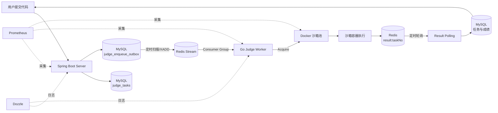
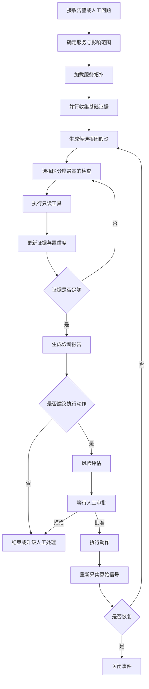

# HinataOps 项目范围与故障诊断设计

## 1. 文档目的

本文档记录 HinataOps 第一阶段已经确认的项目定位、目标系统、故障范围、诊断流程、工具边界、人工审批机制和验收标准。

HinataOps 是用于学习和面试展示的 Demo 项目，但必须接入真实系统、使用真实观测数据，并具备可验证的诊断能力。项目不追求建设完整的企业级运维平台，也不通过针对几个固定错误编写特判来完成演示。

## 2. 项目定位

HinataOps 的定位是：

> 面向多服务系统的证据驱动故障调查 Agent。从告警或人工问题出发，沿服务拓扑采集指标、日志、队列和数据库状态，维护多个根因假设，生成带证据的诊断报告，并在人类批准后执行有限操作和验证恢复。

它不替代 Prometheus、Grafana、CloudWatch、Sentry 等可观测性系统。它负责连接这些数据源，完成传统监控系统难以自动完成的跨系统关联、假设验证和受控处置。

项目重点打磨以下能力：

1. 基于服务拓扑规划调查路径，而不是无目的调用工具。
2. 融合指标、日志、容器、消息队列和数据库等多源证据。
3. 同时维护多个根因假设，并通过具有区分度的查询更新置信度。
4. 所有结论引用可追溯证据。
5. 写操作经过人工审批，并在执行后验证系统是否恢复。
6. 使用故障注入与评测集证明诊断不是针对错误文本的特判。

## 3. 目标系统与环境边界

### 3.1 AoiLearn：主要开发与故障实验环境

AoiLearn 是包含 React、Spring Boot、Python Agent、Go Judge Worker、Docker 沙箱、MySQL、Redis、MinIO、Qdrant、Prometheus、Grafana 和 Dozzle 的教学系统。

HinataOps 在该环境中完成完整闭环：

```text
发现问题 → 调查 → 形成诊断 → 生成动作 → 人工审批 → 执行 → 验证
```

允许在该环境进行故障注入，并开放少量经过约束的写操作。

### 3.2 Bondgumi：真实生产只读验证环境

Bondgumi 是部署在 AWS、经过 Cloudflare 对外服务的 Spring Boot + React 维基网站，并使用 CloudWatch、Sentry 等基础设施。

HinataOps 在该环境中只完成：

```text
采集 → 调查 → 关联 → 报告
```

第一阶段禁止 Agent 自动修改 Bondgumi 生产环境。后续可接入 CloudWatch Logs、Sentry Issue/Event 和 Cloudflare Analytics，证明同一个调查框架可以服务真实线上系统。

## 4. AoiLearn 判题链路



一个判题任务会跨越多个状态存储：

- MySQL `judge_tasks`
- MySQL `judge_enqueue_outbox`
- Redis Stream
- Redis Consumer Group Pending Entry List
- Redis `result:{taskNo}`
- MySQL `code_submissions`

因此，该系统的重要故障类型不是单个进程报错，而是不同阶段之间的状态不一致或流水线停滞。

## 5. 可观测性现状与缺口

| 阶段 | 现有证据 | 关键缺口 | HinataOps 查询方式 |
| --- | --- | --- | --- |
| 接收提交 | HTTP 指标、Server 日志、`judge_tasks` | 缺少完整的请求到任务关联 | Prometheus、日志、MySQL |
| Outbox | `status`、`attempts`、`last_error`、`next_attempt_at` | 没有 pending 数量和最老任务年龄指标 | MySQL 领域查询 |
| Redis Stream | Stream、Consumer Group、Pending Entry List | 当前未采集到 Prometheus | Redis `XINFO`、`XPENDING` |
| Judge Worker | `/health`、普通文本日志 | 健康检查不验证 Redis、Docker和消费循环 | HTTP、Docker、日志 |
| 沙箱池 | active、available、creating、CPU、内存 | 缺少获取沙箱耗时、执行耗时和失败原因分布 | Prometheus、Docker |
| 结果缓存 | `result:{taskNo}`、TTL、状态 | 缺少结果写入失败计数 | Redis、Judge 日志 |
| 结果落库 | MySQL 最终状态、Server 日志 | 缺少待落库数量和执行器积压 | Redis 与 MySQL 对账 |
| 用户侧 | 前端轮询结果 | 缺少端到端判题耗时 | 后续增加业务指标 |

运维判断优先使用以下五类信号：

- Latency：请求或任务各阶段耗时。
- Traffic：请求量和任务产生速率。
- Errors：HTTP、依赖调用和任务失败率。
- Saturation：CPU、内存、线程池、连接池、队列和沙箱池饱和度。
- Changes：发布、配置修改、容器重建和依赖升级。

## 6. 第一阶段故障家族

### 6.1 异步任务流水线停滞

统一用户症状：

> 最近一段时间判题完成率下降、等待时间上升，部分任务长时间处于 pending。

Agent 不能仅根据症状给出固定答案，而要区分以下根因。

#### 根因 A：Outbox 无法投递到 Redis

典型证据：

- `judge_tasks.pending` 上升。
- `outbox.pending` 上升。
- `outbox.attempts` 持续增加并记录 Redis 错误。
- Redis Stream lag 没有同步增长。
- Judge Worker 正常存活。

#### 根因 B：Worker 停止消费

典型证据：

- Outbox 已标记 sent。
- Redis Stream lag 持续增长。
- Consumer 数量减少或 idle 时间异常。
- Judge 健康接口不可达。
- Judge 容器处于 exited 或 restarting。

#### 根因 C：Worker 存活但无法创建沙箱

典型证据：

- Judge 健康接口正常。
- Redis Pending 增长。
- `pool_available` 为 0。
- `pool_creating` 或 Docker 容器事件异常。
- Judge 日志出现容器池扩容或补充失败。

该案例用于证明进程存活不等于服务具备实际处理能力。

#### 根因 D：结果写入失败但 Stream 消息已 ACK

典型证据：

- Outbox 为 sent。
- Stream lag 已下降，Pending 中没有对应消息。
- Judge 日志出现结果写入失败。
- Redis 不存在对应的 `result:{taskNo}`。
- MySQL 中任务仍为 pending。

这是“消息系统认为任务完成，但业务系统永远收不到结果”的跨系统状态不一致。

#### 根因 E：Redis 已有终态结果，但 Server 没有落库

典型证据：

- Redis `result:{taskNo}` 为 completed/failed/timeout。
- MySQL `judge_tasks` 仍为 pending。
- Server 日志出现异步持久化失败。
- Judge Worker、Stream lag 和沙箱均正常。

### 6.2 Web 请求错误率或延迟异常

统一入口症状：

```text
HTTP 5xx 上升，或 P95/P99 延迟超过正常基线。
```

调查依赖链：

```text
Nginx
  ↓
Spring Boot
  ├── HikariCP → MySQL
  ├── Redis
  ├── MinIO
  └── Python Agent → Qdrant / LLM
```

第一阶段重点区分：

1. 数据库连接池耗尽或数据库响应变慢。
2. Agent、Qdrant 或外部 LLM 局部变慢。
3. Nginx 上游不可达或应用处于重启状态。

同一调查模型后续迁移到 Bondgumi，并增加 Cloudflare、CloudWatch 和 Sentry 证据。

## 7. MCP 与 Tool 边界

第一版不为每种基础设施分别创建 MCP Server。项目先实现一个本地 `ops-mcp-server`，按照命名空间暴露工具：

```text
topology.*
prometheus.*
docker.*
redis.*
mysql.*
logs.*
runbook.*
deployment.*
action.*
```

MCP Server 负责连接真实基础设施、执行参数校验、标准化结果并隐藏凭证；HinataOps Core 作为 MCP Client，根据当前调查状态选择 Tool。

### 7.1 受控通用 Toolset 与领域 Toolset

HinataOps 同时保留两类只读能力，而不是在“只提供定制查询”和“允许无限制任意查询”之间二选一：

| 类型 | 目的 | 示例 | Agent 使用时机 |
| --- | --- | --- | --- |
| 领域 Toolset | 为已知业务流水线返回紧凑、语义明确、可直接对照的证据 | `aoi_judge_get_pipeline_summary`、`aoi_judge_get_stream_summary` | 已知 AoiLearn 判题故障、需要快速建立基线时优先使用 |
| 通用数据源 Toolset | 探索未知表、指标、Key 或资源，支持未来接入不同项目 | `mysql_readonly_query`、`prometheus_query`、`redis_xinfo_stream` | 领域 Tool 证据不足，且已有明确待验证假设时使用 |

“通用”表示同一 Toolset 能面向多个已配置实例和不同项目复用；不表示把任意 Shell 文本、任意 SQL、任意 Redis 命令或任意网络目标直接交给模型。通用 Toolset 必须满足：

1. 仅选择已配置的 `instance`；凭证、主机和数据库名不由 Tool 参数提供。
2. 使用基础设施层面的最小权限：数据库账号只读、Redis ACL 禁止写和管理命令、HTTP 仅允许白名单主机/路径/方法。
3. 对表达式或命令使用语法/命令白名单校验；例如 SQL 仅允许 `SELECT`、`SHOW`、`DESCRIBE`、`EXPLAIN`、`WITH`，Redis 仅允许审核过的读取命令。
4. 强制超时、分页、最大行数/Key 数/消息数/字节数和时间范围，返回聚合或有界样本。
5. 记录 Tool 调用审计信息；写操作与通用只读 Toolset 分离注册。

对于 AoiLearn，判题领域 Toolset 应优先于通用 Toolset。一个典型路径是先调用 `aoi_judge_get_pipeline_summary`，仅当它不能解释问题时，再带着具体假设调用受控 PromQL、只读 SQL 或 Redis Stream 查询。

#### Core + Plugin 扩展边界

HinataOps Core 提供 MCP 生命周期、实例注册表、访问策略和基础设施 Adapter；领域 Toolset
以独立 Plugin 的形式提供业务配置、领域解释器与 MCP Tool 注册逻辑。Core 不得直接导入
`aoi_learn_judge`，也不得在通用 `EnvironmentConfig` 中定义 AoiLearn 的表、Stream、指标或
Toolset 设置。

当前已完成领域解释器与 Adapter 的分层，以及 Core 与 AoiLearn Plugin 的装配解耦。Core 通过
`hinataops.toolsets` package entry point 发现 Plugin；AoiLearn 的配置模型与 MCP 注册器均在
Plugin 内，`config.py` 不再持有 AoiLearn 配置模型。

扩展规则如下：

1. 对已安装的 Toolset 接入另一环境，只修改该环境的实例映射、凭证引用与 Toolset 配置。
2. 对新业务系统，新增独立 Plugin；其配置模型、领域 SQL/指标/Stream 和 Tool 注册器均留在
   Plugin 内，而不修改 Core。
3. Core 通过 Python package entry point 发现 Plugin，并仅根据通用的名称、启用状态和
   `toolset_settings.<plugin-name>` 原始配置装配它。
4. Plugin 可以复用 Core 的 Adapter，但不能绕开策略、实例注册表或 MCP 返回契约。

该模式对应 Java/Spring Boot 中的 `core` 模块加业务 `starter`：Starter 被安装后由自动配置
发现；新业务能力不是由 YAML/TOML 凭空生成，而是由独立模块提供并由配置选择启用。

### 7.2 第一阶段只读工具

```text
topology_get_service
topology_get_dependencies

prometheus_query
prometheus_query_range

docker_list_containers
docker_inspect_container
docker_get_logs
docker_get_stats

redis_stream_info
redis_consumer_groups
redis_pending_entries
redis_get_task_result

aoi_judge_get_pipeline_summary
aoi_judge_get_task_state
aoi_judge_get_outbox_summary

mysql_list_tables
mysql_describe_table
mysql_readonly_query

runbook_search
deployment_get_current_version
```

当前 P1 已实现的是 AoiLearn 判题领域查询；它们应迁入 `aoi_learn_judge` Toolset。通用 MySQL、Redis、Prometheus 与 Docker Toolset 只在上述权限、输入校验和输出预算全部实现后再注册。这样既保留领域查询的稳定性，也保留未知故障场景所需的探索能力。

### 7.3 第一阶段写工具

第一版只开放一个实际写操作：

```text
docker_restart_service
```

它只能作用于 AoiLearn Demo 环境中的允许服务。调用前必须生成动作计划并获得人工批准，调用后必须重新检查原始告警和关键指标。

其他动作，例如扩容 Worker、重新认领 Pending 消息、重新投递任务或执行版本回滚，第一阶段只生成建议或 dry-run 计划。

## 8. 调查型 Agent 状态图



### 8.1 核心状态

```python
class IncidentState:
    incident_id: str
    query: str
    target_environment: str
    affected_services: list[str]
    topology: dict
    observations: list[Observation]
    hypotheses: list[Hypothesis]
    investigation_round: int
    proposed_action: ProposedAction | None
    approval_status: str | None
    execution_result: dict | None
    verification_result: dict | None
```

证据必须结构化并保留来源：

```python
class Observation:
    evidence_id: str
    source: str
    query: str
    observed_at: datetime
    value: dict
    summary: str
    reliability: str
```

假设同时保存支持证据和反证：

```python
class Hypothesis:
    cause: str
    confidence: float
    supporting_evidence_ids: list[str]
    contradicting_evidence_ids: list[str]
    next_check: str | None
```

LLM 负责提出假设、比较解释和选择下一步调查方向；确定性代码负责保存证据、限制循环、检查权限、执行动作和验证结果。

## 9. 调查预算

第一版采用简单约束：

- 最多三轮假设调查。
- 每轮最多并行调用四个只读工具。
- 新查询必须能够区分至少两个当前假设，或验证当前最高置信度假设的关键缺口。
- 工具返回必须经过裁剪和结构化，禁止将无限日志或完整指标序列直接放入模型上下文。

## 10. 人工监督与恢复验证

写操作流程固定为：

```text
生成动作计划
  ↓
展示目标、理由、风险、影响范围和回滚方式
  ↓
人工批准
  ↓
执行动作
  ↓
重新采集原始信号
  ↓
判断恢复、未恢复或产生新问题
```

执行成功只表示命令返回成功，不表示事故恢复。关闭事件必须满足预先定义的恢复条件，例如：

- Judge Worker 恢复可达。
- Redis Stream lag 开始下降。
- 新提交能够进入终态。
- HTTP 错误率恢复至阈值内。
- P95 延迟恢复至基线附近。

## 11. 故障注入与验收标准

使用相同入口症状“判题任务等待时间异常”，分别注入：

1. 停止 `judge-python`。
2. 阻断 Judge 到 Redis 的连接。
3. 使 Docker 无法创建沙箱容器。
4. 制造 Redis 结果缺失但 Stream 已 ACK 的状态。
5. 制造 Redis 已有终态结果但 MySQL 仍为 pending 的状态。

Agent 只能使用标准工具和观测信号，不接收故障注入类型作为提示。

核心评测指标：

| 指标 | 含义 |
| --- | --- |
| Root Cause Top-1 Accuracy | 第一根因是否正确 |
| Evidence Completeness | 是否引用关键证据 |
| Contradiction Handling | 是否发现并处理反证 |
| Tool Call Count | 是否进行了无意义查询 |
| Unsafe Action Count | 是否提出或执行错误操作 |
| Recovery Verification | 执行后是否验证真实恢复 |

第一阶段验收目标：

- 五个判题故障实验中，Top-1 根因识别至少正确四个。
- 每个诊断结论至少引用两个独立数据源。
- 未经审批的写操作数量为零。
- 所有实际执行的动作都有恢复验证。
- 修改故障注入方式或错误文本后，调查流程仍然能够工作。

## 12. 实施顺序

1. 定义 AoiLearn 服务拓扑和 IncidentState。
2. 确定 MCP Tool 的输入输出 Schema。
3. 实现 Docker、Redis、MySQL、Prometheus 四类只读工具。
4. 完成“判题流水线停滞”的调查闭环。
5. 建立五个故障注入实验和评测集。
6. 增加人工审批和单个容器重启动作。
7. 实现 HTTP 错误率或延迟故障家族。
8. 接入 Bondgumi 的 CloudWatch、Sentry、Cloudflare，只开放只读能力。

## 13. 非目标

第一阶段明确不实现：

- 完整企业级告警平台。
- Kubernetes、多集群或跨云调度。
- 大量自动修复动作。
- 无人监督的生产环境变更。
- 复杂 RBAC、多租户、审批流平台。
- 为每个数据源拆分独立微服务。
- 仅为展示而引入图数据库、工作流平台或消息总线。

这些能力只有在能够直接提高第一阶段诊断效果时才考虑引入。
